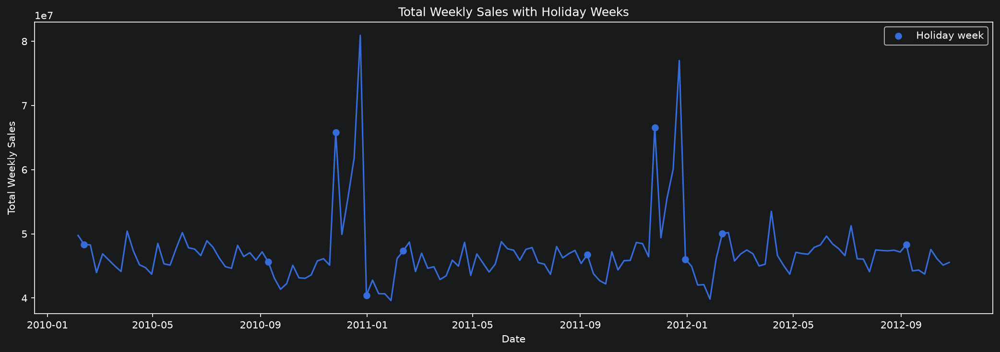
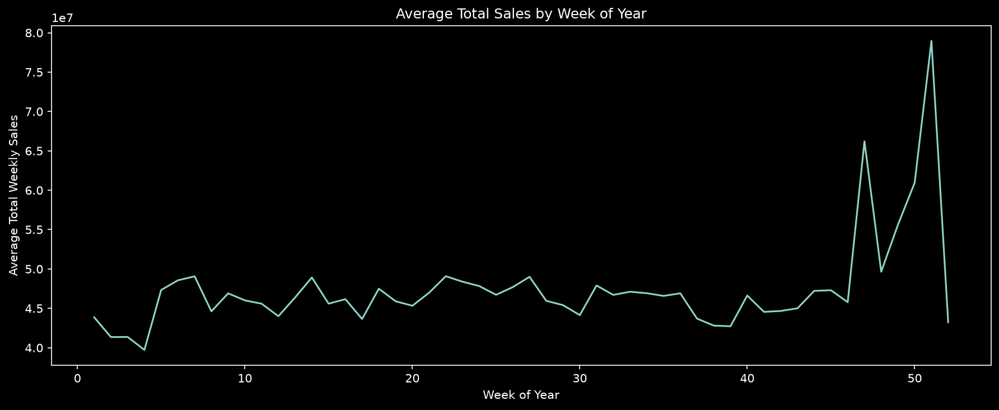
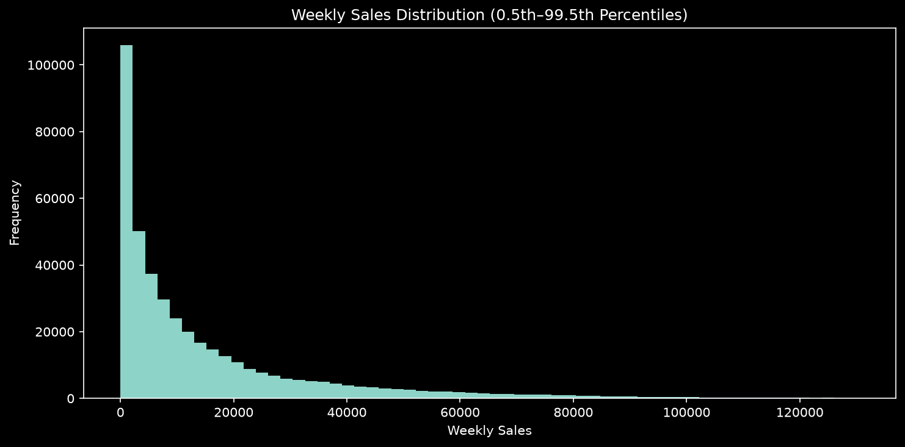
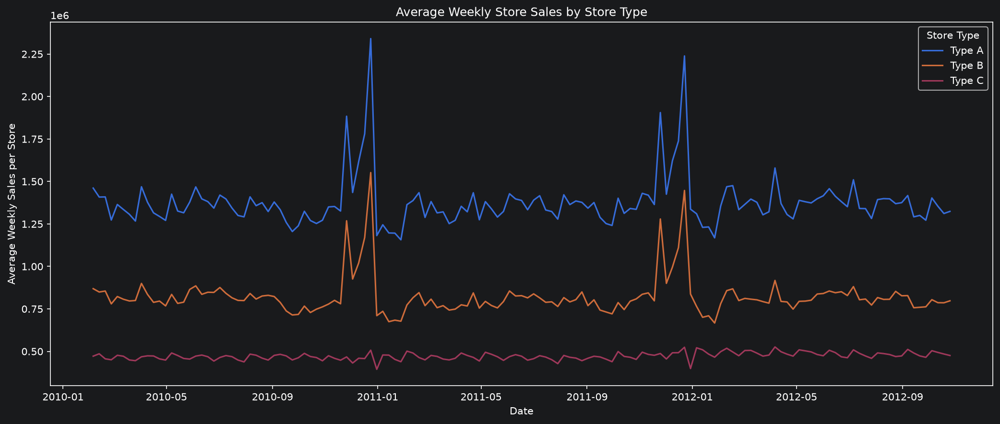
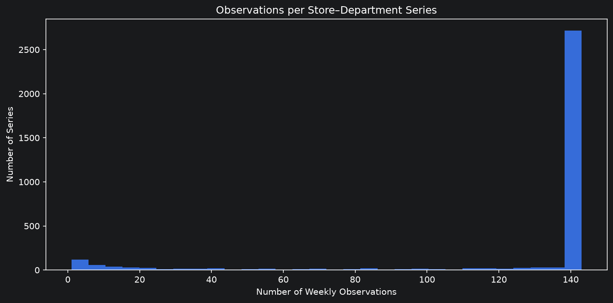
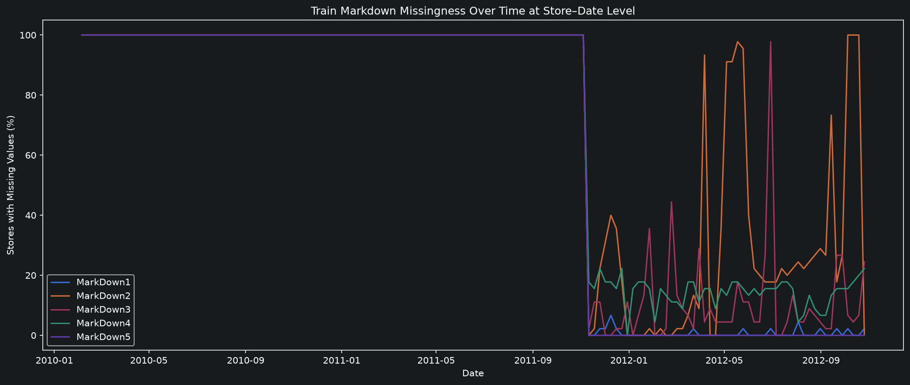
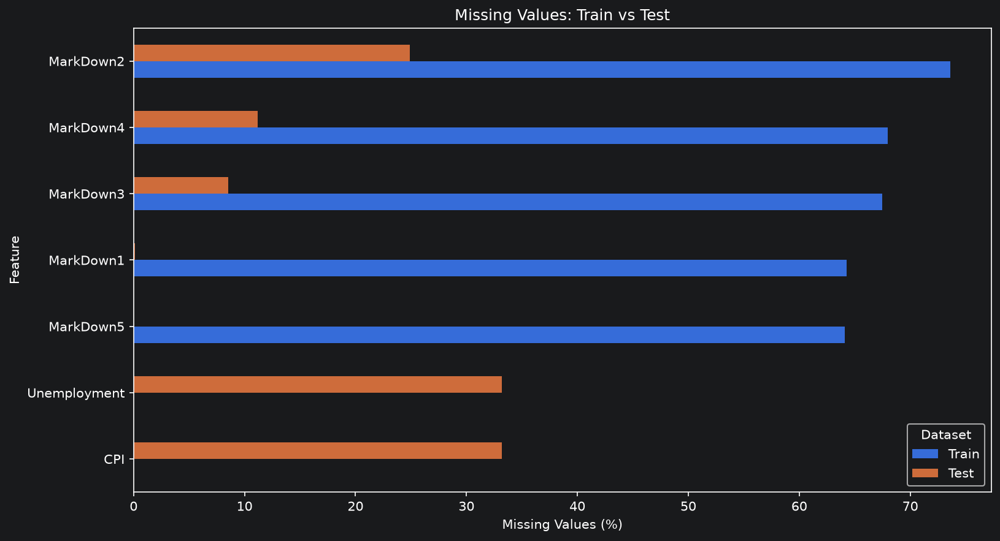
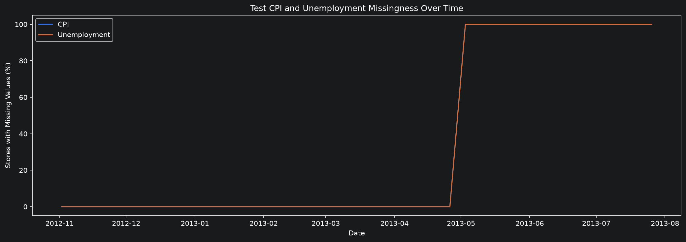
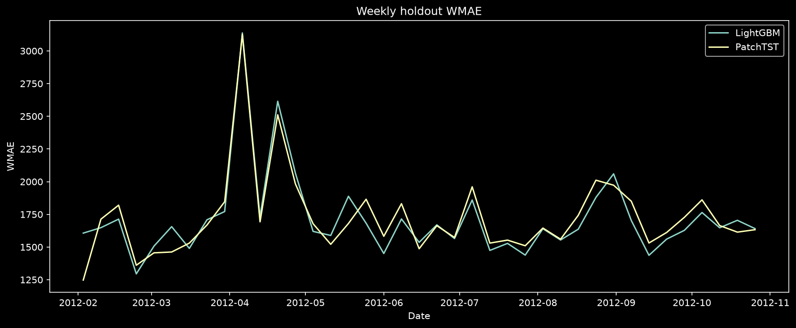
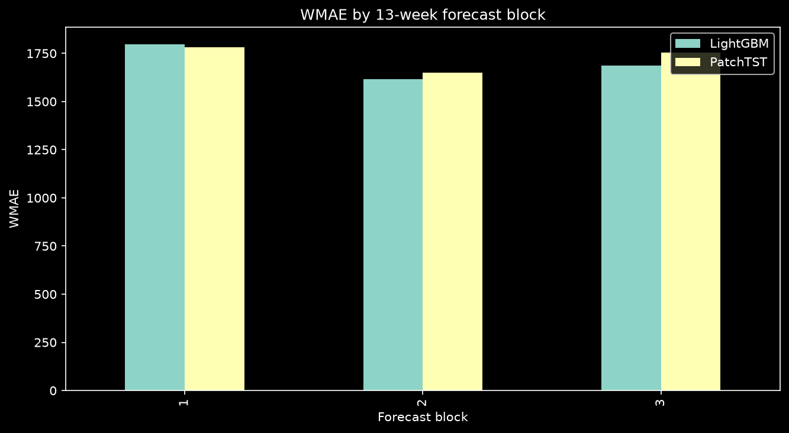

# Walmart Store Sales Forecasting

## პროექტის მოკლე აღწერა

ეს პროექტი არის time-series forecasting ამოცანა, რომელშიც ჩვენი მიზანია 45 მაღაზიის 81
დეპარტამენტის **ყოველკვირეული გაყიდვების** (`Weekly_Sales`) პროგნოზირება მომავალი 39 კვირისთვის.


### მონაცემები

| მახასიათებელი | მნიშვნელობა |
|---|---|
| Train Rows | 421,570 |
| მაღაზიები × დეპარტამენტები | 45 × 81 |
| დროითი სერიები (Store × Dept) | 3,331 |
| Train Period | 2010-02-05 → 2012-10-26 (143 weeks) |
| Test Period | 2012-11-02 → 2013-07-26 (39 weeks) |
| Test Rows | 115,064 |

---

## შეფასების მეტრიკა

მოდელი ფასდება **WMAE (Weighted Mean Absolute Error)**  მეტრიკით:

```
WMAE = ( Σ wᵢ · |yᵢ − ŷᵢ| ) / ( Σ wᵢ )
```

სადაც წონა `wᵢ = 5` **სადღესასწაულო კვირებისთვის** (Super Bowl, Labor Day, Thanksgiving,
Christmas) და `wᵢ = 1` არასადღესასწაულო კვირებისთვის.

**რატომ WMAE და არა RMSE/MAE:**
- მეტრიკა **დოლარებში** იზომება, ამიტომ მაღალი მოცულობის დეპარტამენტების ცდომილება ბუნებრივად
  დომინირებს. ეს ნიშნავს, რომ მოდელმა კარგად უნდა იმუშაოს დიდი გაყიდვების მქონე სერიებზე.
- **სადღესასწაულო კვირების 5 წონა** მოდელს აიძულებს, სწორად იწინასწარმეტყველოს ზუსტად ის კვირები,
  სადაც გაყიდვები პიკს აღწევს და პროგნოზირება ყველაზე რთულია (Black Friday, Christmas).

დამატებით ვაკვირდებით `MAE`-სა და `RMSE`-ს, როგორც დამხმარე დიაგნოსტიკურ მეტრიკებს.

---

## ჩვენი მიდგომა

პრობლემის გადასაჭრელად გამოვიყენეთ შემდეგი workflow:

1. **EDA** — მონაცემების სტრუქტურის, სეზონურობის, გამოტოვებული მნიშვნელობებისა და გამოწვევების იდენტიფიცირება
2. **Feature Engineering** — კალენდარული, lag და აგრეგირებული ცვლადების აგება, leakage თავიდან აცილებით
3. **Preprocessing** — თითოეული მოდელის ოჯახისთვის შესაბამისი დამუშავება (OHE ხეებისთვის, native categoricals CatBoost-თვის, instance normalization ნეირონულებისთვის)
4. **Validation** — ერთიანი ვალიდაცია ყველა მოდელისთვის: expanding-window CV (3 fold × 13 კვირა) მოდელის შერჩევისთვის + ერთი 39-კვირიანი chronological holdout გამარჯვებულისთვის
5. **Model Training + შედარება** — თითოეული არქიტექტურის tuning, საუკეთესოს არჩევა CV WMAE-ით

### ვალიდაციის ორი scope

მნიშვნელოვანი მეთოდოლოგიური დეტალი:

- **`representative_series`** — კლასიკური მოდელები (ARIMA, SARIMA, Prophet) და DLinear შეფასდა **30
  representative სერიაზე** (10 დაბალი + 10 საშუალო + 10 მაღალი მოცულობის tier). ეს არჩევანი
  განპირობებულია იმით, რომ per-series სტატისტიკური მოდელების სრულ dataset-ზე გაშვება
  გამოსათვლელად შრომატევადია.
- **`full_dataset`** — ხეები, ნეირონული და foundation მოდელები, როგორც **გლობალური** მოდელები,
  შეფასდა მთელ ~3,300 სერიაზე.

**განსხვავებული scope-ის მოდელების WMAE პირდაპირ არ არის შესადარებელი**

---

## რეპოზიტორიის სტრუქტურა

```
walmart-store-sales-forecasting/
├── data/
│   ├── raw/                                    # Kaggle CSV ფაილები
│   └── processed/                              # merged train/test (parquet)
├── notebooks/
│   ├── EDA.ipynb                               # Exploratory Data Analysis
│   ├── model_experiment_{architecture}.ipynb   # თითოეული მოდელის არქიტექტურისთვის მთავარი სამუშაო ფაილი მოდელის დასატრენინგებლად

│   ├── model_comparison.ipynb                  # მოდელების საბოლოო შედარება
│   ├── model_inference.ipynb                   # საბოლოო პროგნოზი და submission
├── src/walmart_forecasting/                    # საზიარო კოდი (features, metrics, validation, tracking)
├── reports/
│   ├── figures/                                # EDA და შედარების გრაფიკები
│   ├── tables/                                 # თითოეული მოდელის შედეგები (CSV)
│   └── submissions/                            # Kaggle submission ფაილები
└── README.md
```

Shared ლოგიკა (`WMAE`, feature builders, CV splits, MLflow/wandb tracking) გატანილია
`src/walmart_forecasting/`-ში.
---

## Exploratory Data Analysis (EDA)

### გაყიდვების დინამიკა და სეზონურობა



ჯამური ყოველკვირეული გაყიდვები ცხადად აჩვენებს **ძლიერ წლიურ სეზონურობას** — გაყიდვები პიკს
აღწევს ნოემბერ-დეკემბერში (Thanksgiving/Black Friday და Christmas). ეს პიკები არის ამოცანის
ყველაზე რთული და მაღალწონიანი ნაწილი (5).



week-of-year-ის ჭრილში საშუალო გაყიდვები კიდევ უფრო ნათლად აჩვენებს, რომ **სადღესასწაულო კვირები
სისტემურად გამოირჩევა**. ამიტომ `lag_52` (შარშანდელი ანალოგიური კვირა) და
holiday-features მნიშვნელოვანი ცვლადებია.

### გაყიდვების განაწილება



`Weekly_Sales` განაწილება არის **right-skewed** — უმეტესობა დაბალია,
მაგრამ სადღესასწაულო პიკები ქმნიან გრძელ „კუდს".

### მაღაზიის ტიპები



მაღაზიები დაყოფილია A, B და C ტიპებად, რომლებიც მკვეთრად განსხვავდებიან მოცულობით, რომელიც
მნიშვნელოვანი კატეგორიული ცვლადია (`Type`, `Size`).

### სერიების სიგრძე



სერიების უმეტესობა სრული 143 კვირისაა, მაგრამ ნაწილი გვიან იწყება ან აქვს გამოტოვებული კვირები.
ეს დეტალი კრიტიკული აღმოჩნდა DLinear (sliding windows საჭიროებს უწყვეტ კალენდარს) და
Prophet-თვის (ძალიან მოკლე სერიები საჭიროებდა fallback-ს).

### გამოტოვებული მნიშვნელობები (Missing Values)




`MarkDown1–5` არის promotional markdown-ებთან დაკავშირებული ხუთი
ანონიმური მახასიათებელი და არა გაყიდვების მაჩვენებელი. მათი ზუსტი
ბიზნეს მნიშვნელობა და საზომი ერთეული არ ვიცით.

Missingness-ს მკაფიო დროითი სტრუქტურა აქვს: მონაცემები მხოლოდ 2011 წლის
ნოემბრის შემდეგ იწყება და მოგვიანებითაც ყველა მაღაზიისა და კვირისთვის
არ არის სრულად ხელმისაწვდომი. ამიტომ განსაკუთრებით ადრეული პერიოდის `NaN`
მნიშვნელობები სტრუქტურულია. ისინი ავტომატურად ნულად არ ჩაგვითვლია,
რადგან გამოტოვება შეიძლება ნიშნავდეს როგორც promotional აქტივობის
არარსებობას, ისე ინფორმაციის არქონას.



**კრიტიკული აღმოჩენა**: `CPI` და `Unemployment` **33%-ით გამოტოვებულია test პერიოდში**. ეს
ნიშნავს, რომ მოდელი, რომელიც დამოკიდებულია ეკონომიკურ რეგრესორებზე, ვერ დააგენერირებდა
პროგნოზს test-ზე. ამან განაპირობა Prophet-ის საბოლოო კონფიგურაციის არჩევანი (ეგზოგენური
რეგრესორების გარეშე).

---

## Feature Engineering

### საბაზისო ცვლადები (ყველა მოდელისთვის)

- **კალენდარული**: `year`, `month`, `quarter`, `week_of_year`
- **Missing indicators**: `MarkDownN_missing`, `CPI_missing`, `Unemployment_missing`
- **`lag_52`** — შარშანდელი იმავე კვირის გაყიდვა. **გადამწყვეტი leakage-safe ცვლადი**:
  39-კვირიანი პროგნოზის პერიოდისთვის `lag_52` ცნობილია მთელ პერიოდზე (test row-ის 52 კვირით
  უკან თარიღი ხვდება train პერიოდში). მოკლე lag-ები (lag_1..lag_38) test-ზე ხელმისაწვდომი ვერ
  იქნებოდა, ამიტომ თავიდან ავირიდეთ.

### Model-Specific Feature Engineering

- **ხეები (LightGBM/XGBoost)**: `Store/Dept/Type` One-Hot Encoding (~130 sparse სვეტი),
  MarkDown zero-imputation, ეკონომიკური ცვლადების median-imputation.
- **CatBoost**: **Native categorical handling** — `Store/Dept/Type` გადაეცემა `cat_features`-ად
  (ordered target statistics), OHE გარეშე. დამატებით: **native NaN** markdown-ებისთვის,
  **holiday-distance** ცვლადები (`weeks_to_christmas`, `weeks_to_thanksgiving`) და **year-ago
  window** (lag_50..54 + rolling aggregates).
- **DLinear**: per-series z-score + **RevIN** (per-window instance normalization) — რაც აღმოჩნდა
  ამ არქიტექტურის ყველაზე მნიშვნელოვანი კომპონენტი.
- **ნეირონული (PatchTST/N-BEATS)**: instance normalization, channel-independent encoder,
  weighted MAE training, recursive forecasting (13×3 = 39 კვირა).

---

## Training

### Seasonal Naive Baseline

საბაზისო მოდელი თითო Store–Department სერიისთვის მიმდინარე კვირის
პროგნოზად იყენებს 52 კვირის წინ დაფიქსირებულ გაყიდვას. თუ შესაბამისი
ისტორია არ არსებობს, გამოიყენება იერარქიული fallback.

ეს baseline გვიჩვენებს, რამდენად დიდი გაუმჯობესება მოაქვს უფრო რთულ
არქიტექტურებს მხოლოდ წლიური სეზონურობის გამეორებასთან შედარებით.

- **Holdout WMAE: 1812.73**

### სტატისტიკური მოდელები (representative scope, 30 სერია)

#### ARIMA

ARIMA (AutoRegressive Integrated Moving Average) კლასიკური სტატისტიკური მოდელია, რომელიც სერიის
მომავალს **მისივე წარსულის საფუძველზე** პროგნოზირებს. მისი სახელი სამ ნაწილს აერთიანებს:

- **AR — AutoRegressive, პარამეტრი `p`**: მიმდინარე კვირის გაყიდვა გამოითვლება
  ბოლო `p` კვირის გაყიდვების შეწონილ ჯამად. ანუ მოდელი უყურებს „წინა კვირებს" და მათგან სწავლობს.
  მაგალითად `p=2` ნიშნავს, რომ პროგნოზი ბოლო ორ კვირაზეა დამოკიდებული.
- **I — Integrated, პარამეტრი `d`**: სანამ მოდელი იმუშავებს, სერია
  უნდა გახდეს **stationary** — ანუ მისი საშუალო და ტრენდი დროთა განმავლობაში არ უნდა იცვლებოდეს.
  ამის მისაღწევად ხდება **დიფერენცირება**: მიმდინარე მნიშვნელობას აკლდება წინა მნიშვნელობა
  (`yₜ − yₜ₋₁`), რაც აშორებს ტრენდს. `d` არის, თუ რამდენჯერ ვიმეორებთ ამ მოქმედებას.
- **MA — Moving Average, პარამეტრი `q`**: მოდელი დამატებით სწავლობს **ბოლო `q`
  პროგნოზის შეცდომიდან** — თუ წინა კვირებში სისტემურად „აცდა", ეს ინფორმაცია გამოიყენება
  შესწორებისთვის.

ამ სამ რიცხვს ერთად `(p, d, q)` **order** ჰქვია და სწორედ ის განსაზღვრავს კონკრეტულ
ARIMA მოდელს.

**AICc და order-ის შერჩევა (calibration)**

პრობლემა ის არის, რომ სწორი `(p, d, q)` წინასწარ არ ვიცით. მის ასარჩევად ვიყენებთ **AICc**
(Akaike Information Criterion, corrected) — შეფასების ქულას, რომელიც **აბალანსებს 2 რამეს**:
რამდენად კარგად ერგება მოდელი მონაცემებს **მინუს** ჯარიმა მოდელის კომპლექსურობისთვის. დაბალი AICc = უკეთესი. ეს იცავს **overfitting-ისგან**.

**Order-ის შერჩევის პროცესს (რომელი `(p,d,q)` აქვს ყველაზე დაბალი AICc) calibration ვუწოდეთ.** ეს
შერჩევა გავაკეთეთ **მხოლოდ ყველაზე ადრეული CV fold-ის სატრენინგო მონაცემებზე** — რათა order-ის
არჩევისას **data leakage** თავიდან აგვერიდებინა.

**ეგზოგენური input (ARIMAX)**

ჩვეულებრივი ARIMA მხოლოდ თავად გაყიდვების ისტორიას იყენებს. მაგრამ შეგვიძლია მოდელს დამატებით
მივცეთ **გარე (exogenous / ეგზოგენური) ცვლადებიც** — ანუ ინფორმაცია, რომელიც *თავად გაყიდვა არ
არის*, მაგრამ მასზე გავლენას ახდენს: მაგალითად `IsHoliday`,
ტემპერატურა, საწვავის ფასი, CPI, უმუშევრობა. როცა ARIMA-ს ასეთ გარე ცვლადებს ვამატებთ, მას
**ARIMAX** ("X" — eXogenous) ეწოდება.

**როგორ გამოვიყენეთ ამ პროექტში**

ARIMA-ს ვამუშავებდით **per-series** — ანუ **თითო (Store × Dept) წყვილისთვის ცალკე ARIMA მოდელი**,
რადგან თითოეულ დეპარტამენტს თავისი ქცევა აქვს. ჩავატარეთ 4 ექსპერიმენტი (trial):

1. **გარე ცვლადების გარეშე** — მხოლოდ გაყიდვების ისტორია (სუფთა ARIMA)
2. **`IsHoliday` რეგრესორით** — ვამატებთ isHoliday ცვლადს
3. **სრული ეკონომიკური ARIMAX** — ვამატებთ ეკონომიკურ ცვლადებს
4. **ფართო grid** — order-ის უფრო დიდი დიაპაზონის გადამოწმება

- **Holdout WMAE: 2729.1** | CV WMAE: 2268.3
- **ARIMA ვერ იჭერს წლიურ სეზონურობას** (52-კვირიან ციკლს) — ის კარგად მუშაობს მოკლევადიან
  დამოკიდებულებებზე, მაგრამ ვერ „ხედავს", რომ დეკემბერში გაყიდვები ყოველ წელს იზრდება. სწორედ
  ამიტომ არის ეს ყველაზე სუსტი შედეგი — და ამიტომ გადავედით SARIMA-ზე, რომელიც სეზონურ კომპონენტს
  პირდაპირ ამატებს.

#### SARIMA

SARIMA (Seasonal ARIMA) ARIMA-ს **სეზონურ კომპონენტს** ამატებს. გარდა
ჩვეულებრივი `(p, d, q)` order-ისა, მას აქვს **სეზონური order `(P, D, Q)ₘ`**, სადაც `m` არის
სეზონის სიგრძე. ჩვენს შემთხვევაში **`m = 52`** (52 კვირა = ერთი წელი), ანუ SARIMA პირდაპირ
სწავლობს, რომ „ამ კვირის გაყიდვა ჰგავს **შარშან ამავე კვირის** გაყიდვას" — ზუსტად ის წლიური
სეზონურობა, რომელსაც ARIMA ვერ იჭერდა.

**ჩატარებული trials** (order-ს კვლავ AICc-ით ვირჩევდით, per-series):

1. **A — გარე ცვლადების გარეშე, base grid**: მხოლოდ გაყიდვების ისტორია. `(p,d,q)` და სეზონური
   `(P,D,Q)` პარამეტრები თითოეული {0,1}-დან.
2. **B — `IsHoliday` regressor-ით, base grid**: ვამატებთ isHoliday ცვლადს
3. **C — გარე ცვლადების გარეშე, ფართო სეზონური grid**: სეზონური `(P,D,Q)` ფართო დიაპაზონიდან
   {0,1,2} — ვამოწმებთ, დაგვეხმარება თუ არა უფრო რთული სეზონური სტრუქტურა.

- **Holdout WMAE: 2555.8** | CV WMAE: 1936.7
- სეზონურობის დამატებამ CV WMAE ~15%-ით გააუმჯობესა ARIMA-სთან შედარებით (2268 → 1937), რაც
  ადასტურებს, რომ სეზონურობა მნიშვნელოვანია.

#### Prophet

Prophet არის Meta-ს (Facebook) მიერ შექმნილი პროგნოზირების მოდელი. ARIMA-გან განსხვავებით, ის
სერიას **სამ ცალკეულ, გასაგებ კომპონენტად შლის** და ჯამად აერთიანებს:

```
გაყიდვა = ტრენდი + სეზონურობა + სადღესასწაულო ეფექტები
```

- **ტრენდი (trend)** — გრძელვადიანი ზოგადი მიმართულება (გაყიდვა იზრდება თუ მცირდება დროთა
  განმავლობაში). Prophet-ს შეუძლია ტრენდი „მოხაროს" გარკვეულ წერტილებში (**changepoints**),
  სადაც ზრდის ტემპი იცვლება.
- **სეზონურობა (seasonality)**
- **სადღესასწაულო ეფექტები (holidays)** — კონკრეტული დღეების (Thanksgiving, Christmas და ა.შ.)
  ცალკე მოდელირება, თითოეულის ირგვლივ „ფანჯრით" (რამდენი დღით ადრე/გვიან მოქმედებს ეფექტი).

**ტესტირებული პარამეტრების ახსნა**

- **seasonality mode — additive vs multiplicative**: *additive* ნიშნავს, რომ სეზონური ეფექტი
  **ფიქსირებული ოდენობაა**, რომელიც ემატება (მაგ. „დეკემბერში +5000 ერთეული"). *multiplicative*
  ნიშნავს, რომ ეფექტი **პროპორციულია** მიმდინარე დონისა (მაგ. „დეკემბერში +30%"). დიდი გაყიდვების
  დეპარტამენტში multiplicative უფრო დიდ აბსოლუტურ პიკს ქმნის.
- **yearly seasonality Fourier order**: განსაზღვრავს, **რამდენად „მოქნილი/დახვეწილია" სეზონური
  მრუდი**. დაბალი order = გლუვი, მარტივი ტალღა; მაღალი order (მაგ. 20) = მოდელს შეუძლია უფრო
  **მკვეთრი, რთული** სეზონური ფორმის დაჭერა (მაგალითად ვიწრო, წვეტიანი სადღესასწაულო პიკი). სწორედ
  ეს გახდა გამარჯვებული პარამეტრი.
- **changepoint prior scale**: აკონტროლებს, **რამდენად ადვილად იცვლება ტრენდი** changepoint-ებში.
  მაღალი მნიშვნელობა = მოქნილი ტრენდი (რისკი — overfitting); დაბალი = უფრო ხისტი, გლუვი ტრენდი.
- **holiday window width**: რამდენი დღით ვრცელდება სადღესასწაულო ეფექტი დღესასწაულის ირგვლივ (ვიწრო
  vs ფართო ფანჯარა).

**ჩატარებული 10 trial** (ჯგუფებად):

1. **A / B — seasonality mode**: additive vs multiplicative (მხოლოდ holidays-ით)
2. **C — ეკონომიკური რეგრესორების ablation**: დაგვეხმარება თუ არა CPI/უმუშევრობა/ტემპერატურა
3. **D1 / D2 — changepoint prior scale**: ტრენდის მოქნილობის ვარიაციები
4. **E1 / E2 — yearly seasonality Fourier order**: სეზონური მრუდის მოქნილობა
5. **F — `IsHoliday` regressor-ად**: სადღესასწაულო ცვლადის regressor-ად დამატება
6. **G1 / G2 — holiday window width**: ვიწრო vs ფართო სადღესასწაულო ფანჯარა

**საუკეთესო — E2** (sharp yearly, Fourier order 20): additive seasonality, holidays,
**ეკონომიკური რეგრესორების გარეშე**. რეგრესორების უარყოფა პრაქტიკულადაც მნიშვნელოვანი
აღმოჩნდა — რადგან test პერიოდში CPI/უმუშევრობა 33%-ით გამოტოვებულია, რეგრესორებზე
დამოკიდებული Prophet საერთოდ ვერ დააგენერირებდა პროგნოზს.

- **Holdout WMAE: 1773.6** | CV WMAE: 1616.0 — **საუკეთესო representative scope-ზე**
- Prophet-ის უპირატესობა — **per-series სეზონურობა**: რადგან თითო დეპარტამენტს ცალკე მოდელი აქვს, ის არასდროს ასაშუალოებს ურთიერთსაწინააღმდეგო სეზონურ ფორმებს სხვადასხვა დეპარტამენტს
  შორის (განსხვავებით გლობალური მოდელებისგან).

### გლობალური წრფივი მოდელი — DLinear

DLinear **მინიმალისტური** ნეირონული მოდელია, რომელიც მუშაობს ორ ნაბიჯად:

1. **Decomposition**: შემავალი ფანჯარა (**lookback** — ბოლო რამდენიმე კვირის გაყიდვა)
   იშლება ორ ნაწილად:
   - **trend** — საშუალო ტენდენცია (მიღებული moving average)
   - **seasonal/remainder** — დანარჩენი ნაწილი (`ორიგინალი − trend`)
2. **Linear**: თითო კომპონენტზე ერთი წრფივი ფენა, რომელიც lookback ფანჯარას
   პირდაპირ ასახავს პროგნოზის **horizon-ზე** (მომავალი კვირები). ბოლოს ორივე იჯამება.

- **lookback / horizon**: lookback = რამდენ წარსულ კვირას უყურებს მოდელი (ჩვენთან 52); horizon =
  რამდენ მომავალ კვირას პროგნოზირებს ერთდროულად.
- **global, channel-independent**: „global" ნიშნავს, რომ **ერთი და იგივე მოდელი** გამოიყენება
  ყველა (Store × Dept) სერიაზე (განსხვავებით ARIMA/Prophet-ისგან, სადაც თითო სერიას ცალკე
  მოდელი ჰქონდა). „channel-independent" ნიშნავს, რომ თითოეული სერია დამუშავდება ცალკე, მაგრამ
  **საზიარო წონებით**. ვამუშავეთ ~2,700 სერიაზე, შევაფასეთ 30 representative-ზე.
- **RevIN (per-window instance normalization)**: სანამ ფანჯარა მოდელში შევა ნორმალიზდება,
  ხოლო პროგნოზზე ეს გარდაქმნა უკან ბრუნდება. ეს აშორებს „დონის" სხვაობას სხვადასხვა პერიოდის
  ფანჯრებს შორის.
- **receptive field**: რამდენად შორს ხედავს მოდელი წარსულში (lookback სიგრძე).

**მნიშვნელოვანი შედეგები:**

| ცვლილება | ეფექტი CV WMAE-ზე          |
|---|----------------------------|
| **RevIN** (per-window ნორმალიზაცია) | ~2,688 → ~1,987 (**−26%**) |
| **52-კვირიანი lookback** (26-ის ნაცვლად) | ~2,961 → ~1,890            |
| Metric-aligned weighted loss | ~1,987 → ~1,890            |
| Learning rate tuning | ~0% (ხმაურის ფარგლებში)    |

- **RevIN** (−26%). სანამ RevIN დავამატებდით, DLinear სუსტად მუშაობდა,
  რადგან საზიარო წრფივი ფენა ვერ უმკლავდებოდა სხვადასხვა დონის ფანჯრებს. ნორმალიზაციამ ეს პრობლემა მოაგვარა.
- **52-კვირიანი lookback აუცილებელი აღმოჩნდა**: როცა lookback 26 კვირამდე შევამცირეთ, შედეგი
  **საგრძნობლად გაუარესდა** (1,890 → 2,961) - მეტი მონაცემი ვერ ჩაანაცვლებს სწორ სეზონურობას.
- **Learning rate tuning** — დიდი სხვაობა არ მოგვცა.

- **Holdout WMAE: 1821.2** | CV WMAE: 1889.6

### ხეზე დაფუძნებული მოდელები (full_dataset scope, ~3,300 სერია)

სამივე ხე ტრენინგდება როგორც **ერთი გლობალური tabular მოდელი** — ანუ per-series-ის ნაცვლად, ერთი
მოდელი სწავლობს **ყველა (Store × Dept) სერიას ერთდროულად**, tabular ცვლადებზე (კალენდარი,
`lag_52`, markdown-ები, ეკონომიკური).

**საზიარო სატრენინგო მიდგომა:**

- **holiday-weighted sample weights**: სატრენინგო თითო სტრიქონს წონა ენიჭება — სადღესასწაულო
  კვირას **5**, დანარჩენს 1. ეს ტრენინგს **პირდაპირ ამთხვევს WMAE მეტრიკას** (მოდელი უფრო
  ცდილობს, სადღესასწაულო კვირები სწორად იწინასწარმეტყველოს).
- **MAE objective**: მოდელი ოპტიმიზდება აბსოლუტურ ცდომილებაზე
- **Early stopping**: ტრენინგისას მოდელი ამოწმებს ვალიდაციის შედეგს და ჩერდება, როცა ის აღარ
  უმჯობესდება ~100 იტერაციის განმავლობაში. ეს ავტომატურად არჩევს ხეების ოპტიმალურ რაოდენობას და
  იცავს overfitting-ისგან.
- **ეტაპობრივი tuning**: ჯერ **feature trials** (რომელი ცვლადები დაგვეხმარება), მერე
  **markdown preprocessing** სტრატეგია (zero vs median imputation), ბოლოს **ჰიპერპარამეტრების
  tuning** — ყოველ ეტაპზე გამარჯვებული ირჩევა CV WMAE-ით.

#### LightGBM

OHE preprocessing + `lag_52`. Feature trials: (1) მხოლოდ საბაზისო
კალენდარი, (2) + `lag_52`, (3) `lag_52` ეკონომიკური ცვლადების გარეშე. შემდეგ markdown
preprocessing (zero vs median) და ჰიპერპარამეტრების tuning (`num_leaves`, `learning_rate`,
`min_child_samples`, regularization). ტრენინგი weighted MAE early stopping-ით.

- **Holdout WMAE: 1707.1** | CV WMAE: 1949.2 — **საუკეთესო ხე და ერთ-ერთი საუკეთესო საერთოდ**

#### XGBoost

LightGBM-ის იდენტური pipeline (OHE + `lag_52`, იგივე feature/markdown
trials). დამატებით ჩავატარეთ **capacity diagnostics** — მიზანმიმართული underfit/overfit
ექსპერიმენტები (ძალიან მცირე vs ძალიან დიდი ხეები), რომ დაგვენახა, სად არის ოპტიმალური სირთულის
ზღვარი — და ჰიპერპარამეტრების tuning ამ ზღვარზე დაყრდნობით.

- **Holdout WMAE: 1745.8** | CV WMAE: 2073.1
- ოდნავ ჩამორჩება LightGBM-ს.

#### CatBoost

CatBoost ასევე gradient boosting-ია გადაწყვეტილების ხეებზე (როგორც LightGBM/XGBoost), მაგრამ სამი
მთავარი სიახლით:

1. **Ordered Target Statistics (კატეგორიების კოდირება)**: კატეგორიულ ცვლადებს (მაგ. `Store`,
   `Dept`) აენკოდირებს **target-ის სტატისტიკით** — ე.ი. კატეგორიას ცვლის „ამ კატეგორიის საშუალო
   გაყიდვით". მაგრამ ამას აკეთებს **„ordered" წესით**: თითო სტრიქონისთვის იყენებს მხოლოდ *მის წინ
   მდგომ* სტრიქონებს, **target leakage** რომ არ მოხდეს. სწორედ ამის წყალობით არ სჭირდება One-Hot Encoding.
2. **Ordered Boosting**: ანალოგიური პერმუტაციაზე დაფუძნებული სქემა თავად boosting-თვის, რაც
   ამცირებს overfitting-ის რისკს, განსაკუთრებით მცირე მონაცემებზე.
3. **Symmetric (oblivious) trees**: ხის ერთსა და იმავე დონეზე ყველა კვანძი **ერთი და იმავე
   პირობით** იყოფა. ეს ხდის მოდელს სწრაფსა და უფრო რეგულარიზებულს.

დამატებით, CatBoost-ს აქვს **native NaN handling** — გამოტოვებულ მნიშვნელობებს ამუშავებს
პირდაპირ, imputation-ის გარეშე.

CatBoost-ის მთავარი უპირატესობის (native categorical handling) გამოსაყენებლად,
`Store/Dept/Type` გადავეცით `cat_features`-ად, OHE-ს ნაცვლად. ჩავატარეთ აბლაციები:

- **native cat_features vs OHE encoding** — ვამოწმებთ, მართლა სჯობს თუ არა native მიდგომა
- **native-NaN vs zero-imputed markdown** — ვტოვებთ NaN-ს თუ ნულით ვავსებთ
- **holiday-distance features** (`weeks_to_christmas`, `weeks_to_thanksgiving`) და **year-ago
  window** (lag_50..54 + rolling aggregates) — სადღესასწაულო სეზონის დასაჭერად
- ბოლოს, `depth` / `l2_leaf_reg` / `learning_rate` tuning.

- **Holdout WMAE: 1722.7** | CV WMAE: 2092.5
- Holiday-targeted ცვლადებმა (holiday-distance, year-ago window) მცირე ეფექტი მოგვცა — CV-selection-მა თავად შეარჩია საუკეთესო კონფიგურაცია.

### ნეირონული ქსელები (full_dataset scope)

#### PatchTST

PatchTST არის **Transformer**-ზე დაფუძნებული მოდელი დროითი სერიებისთვის. ორი მთავარი აზრი:

1. **Patching**: ჩვეულებრივ, ტრანსფორმერი თითო კვირას ცალკე ტოკენად იღებდა,
   რაც გრძელი სერიისთვის ძვირი და არაეფექტურია. PatchTST ამის ნაცვლად მიმდევრობით კვირებს **patch-ებად აერთიანებს** (13 კვირის ბლოკები, ყოველ 4 კვირაში).
   თითოეული patch ხდება ერთი ტოკენი. სარგებელი: (ა) patch იჭერს უფრო ფართო **ლოკალურ პატერნს**, რადგან 13 კვირა დაახლოებით 1 კვარტალს მოიცავს. (ბ) ტოკენების რაოდენობა მცირდება, ამიტომ მოდელს შეუძლია **უფრო გრძელი ისტორიის**
   დამუშავება ზედმეტი ძალისხმევის გარეშე.
2. **Channel-independence**: თითო სერია მუშავდება **ცალკე, მაგრამ ერთი და იმავე ტრანსფორმერის წონებით** — სერიებს შორის attention არ ხდება. ამგვარად, მოდელი ყველა სერიიდან საერთო პატერნებს სწავლობს, თუმცა თითოეული სერიის პროგნოზს დამოუკიდებლად აგებს.

**როგორ მუშავდება ერთი 52-კვირიანი ფანჯარა:**

1. **ნორმალიზაცია (RevIN)** — სანამ ფანჯარა მოდელში შევა - ნორმალიზდება.
2. **Patching** — ნორმალიზებული ფანჯარა იჭრება გადამფარავ 13-კვირიან patch-ებად (თითო patch — ერთი
   ტოკენი).
3. **Patch encoding** — თითოეული გაყიდვების patch შესაბამის
   observed/missing mask patch-ს უერთდება და linear projection-ით
   Transformer ტოკენად გარდაიქმნება.
4. **Self-attention** — ტრანსფორმერის მექანიზმი, სადაც თითო patch „უყურებს" ყველა დანარჩენს და
   წყვეტს, რომელი რამდენად მნიშვნელოვანია მისთვის. 
5. **Linear head** — ბოლო წრფივი ფენა, რომელიც attention-ით დამუშავებულ patch-ებს გარდაქმნის
   საბოლოო პროგნოზად (მომდევნო 13 კვირა).
6. **დენორმალიზაცია (RevIN-ის შებრუნება)**

**სატრენინგო სპეციფიკა**

- **გლობალური, supervised, channel-independent** — ერთი მოდელი ~3,300 სერიაზე.
- **context length = 52** — მოდელი უყურებს ბოლო 52 კვირას.
- **patch geometry**: patch_length = 13, stride = 4. 
- **Observation-mask-aware inputs** — გაყიდვების მნიშვნელობებთან ერთად
  Transformer-ს გადაეცემა observed/missing mask, რაც გამოიყენება
  ნორმალიზაციისა და patch encoding-ის დროს.
- **recursive 13×3 forecasting**: მოდელი ერთდროულად პროგნოზირებს **13 კვირას** (HORIZON=13), მერე
  ამ პროგნოზს **უკან სვამს input-ად** და პროცესს იმეორებს — სულ **3-ჯერ = 39 კვირა**. (ამის
  უარყოფითი მხარეა, რომ ცდომილება ბლოკიდან ბლოკში გროვდება.)

**ჩატარებული trials** (გამარჯვებული CV WMAE-ით):

- **context length**: 39 vs 52 კვირა
- **patch geometry**: patch4/stride2, patch8/stride4, patch13/stride4
- **RevIN on/off**: instance normalization-ის ეფექტის შემოწმება

**საუკეთესო მოდელი**: context52 + patch13/stride4 + RevIN.

- **Holdout WMAE: 1735.0** | CV WMAE: 2203.5

#### N-BEATS

N-BEATS აგებულია მხოლოდ **მარტივი fully-connected layer-ებისგან**.
მთავარი იდეაა **doubly residual**. თითოეული ბლოკი ორ რამეს ითვლის:

1. **backcast** — წარსულის რეკონსტრუქცია.
2. **forecast** — წვლილი საბოლოო პროგნოზში.

შემდეგ backcast **აკლდება** შემავალ ისტორიას და residual გადაეცემა მომდევნო ბლოკს. ბოლოს, ყველა ბლოკის **forecast-ები იჯამება** და
იძლევა საბოლოო პროგნოზს.

**სატრენინგო სპეციფიკა**

- **გლობალური** — ერთი მოდელი ~3,300 სერიაზე.
- **input length = 52** — მოდელი უყურებს ბოლო 52 კვირას.
- **recursive 13×3 forecasting**

- **Holdout WMAE: 2019.2** | CV WMAE: 2387.9
- უფრო დიდი პარამეტრების რაოდენობის მიუხედავად, **ჩამორჩება PatchTST-სა და ხეებს**. მთავარი
  მიზეზი — რეკურსიული პროგნოზირება: რადგან თითო 13-კვირიანი ბლოკი შემდეგი ბლოკის ინფუთად საკუთარ ცდომილების მქონე პროგნოზს იყენებს, **ცდომილება ბლოკიდან ბლოკში გროვდება**.

### Foundation მოდელი — TimesFM

TimesFM — Google-ის დროითი სერიების pretrained foundation მოდელი გამოყენებული **zero-shot** რეჟიმში (dataset-ზე დამატებითი ტრენინგის გარეშე).

- **Holdout WMAE: 1706.6** — **საუკეთესო holdout WMAE ყველა standalone მოდელს შორის**
- შთამბეჭდავია, რომ zero-shot foundation მოდელი ედრება სრულად გაწვრთნილ LightGBM-ს.

---

## შედეგების ანალიზი

**Representative scope (30 სერია):**

| მოდელი | Forecast strategy | CV WMAE | Holdout WMAE |
|---|---|---|---|
| Prophet | local per-series | 1616.0 | **1773.6** |
| DLinear | global (channel-indep.) | 1889.6 | 1821.2 |
| SARIMA | local per-series | 1936.7 | 2555.8 |
| ARIMA | local per-series | 2268.3 | 2729.1 |

**Full dataset scope (~3,300 სერია):**

| მოდელი | Forecast strategy | CV WMAE | Holdout WMAE |
|---|---|--|---|
| **LightGBM + PatchTST Ensemble** | equal-weight soft voting | — | **1621.3** |
| **TimesFM** (zero-shot) | foundation | 2441.7 ± 1112.5 | **1706.6** |
| **LightGBM** | global tabular | 1949.2 | **1707.1** |
| CatBoost | global tabular | 2092.5 | 1722.7 |
| PatchTST | global neural | 2203.5 | 1735.0 |
| XGBoost | global tabular | 2073.1 | 1745.8 |
| N-BEATS | global neural | 2387.9 | 2019.2 |
| Prophet (full) | local per-series | — | 2306.2 |

- **გლობალური მოდელები იმარჯვებენ full dataset-ზე**: LightGBM, CatBoost, PatchTST და TimesFM
  ~1700-1735 WMAE-ს აღწევენ, რადგან ისინი **ერთდროულად სწავლობენ ყველა სერიას** და შეუძლიათ
  მსგავს დეპარტამენტებს შორის ინფორმაციის გაზიარება.

  ამის საპირისპიროდ, **per-series Prophet full dataset-ზე მკვეთრად უარესდება (1773 → 2306)**,
  რადგან სრული dataset მოიცავს ბევრ მოკლე ისტორიის მქონე დეპარტამენტს, რომელთაც Prophet ცალკე
  ურგებს მოდელს და ვერ იყენებს სხვა, მსგავს დეპარტამენტებზე ნასწავლ პატერნებს.
- **სეზონურობა და receptive field** უფრო ღირებული აღმოჩნდა, ვიდრე მოდელის სირთულე: DLinear-ის
  ანალიზმა აჩვენა, რომ ნორმალიზაცია (−26%) და lookback-ის შერჩევა (−36%) გადამწყვეტი იყო.
- **CV vs Holdout სხვაობა**: holdout WMAE ხშირად უკეთესია, ვიდრე CV — რადგან CV-ს ბოლო fold
  მოიცავს **სადღესასწაულო სეზონს** (ნოემბერ-იანვარი), რომელიც ყველა მოდელისთვის ყველაზე რთულია.

### LightGBM vs PatchTST

საბოლოო submission-თვის დეტალურად შევადარეთ ორი საუკეთესო მოდელი.




| განზომილება | LightGBM | PatchTST | გამარჯვებული |
|---|---|---|---|
| Overall WMAE | 1707.1 | 1735.0 | LightGBM (+1.63%) |
| Holiday WMAE | 1675.6 | 1781.4 | LightGBM (PatchTST 6.3% უარესი) |
| Series won | 43.2% | **56.8%** | PatchTST |
| Weeks won | **61.5%** | 38.5% | LightGBM |
| P(PatchTST better), bootstrap | — | — | 0.08 (LightGBM სტაბილურად უკეთესი) |

მოდელები **ურთიერთშემავსებელია** — LightGBM უკეთესია აგრეგირებულ WMAE-ზე,
სადღესასწაულო კვირებზე და მაღალი მოცულობის row-ზე, ხოლო PatchTST იმარჯვებს **მეტ ცალკეულ
სერიაზე** (56.8%). მათი ფიქსირებული 50/50 საშუალო პროგნოზის holdout WMAE იყო
**1621.3**, რაც LightGBM-ის შედეგს დაახლოებით **5.03%-ით**,
PatchTST-ის შედეგს დაახლოებით **6.56%-ით**, ხოლო Seasonal Naive baseline-ს **10.56%-ით** აუმჯობესებს.

LightGBM-ს აჯობა სამივე 13-კვირიან forecast block-ზე და როგორც holiday, ისე non-holiday სეგმენტში. Week-level
moving-block bootstrap ანალიზშიც ensemble-ის უპირატესობა სტაბილური იყო.

---

## საბოლოო შედეგი — Kaggle Submission

საბოლოო submission: **LightGBM + PatchTST Equal-Weight Ensemble** .

- LightGBM ჩაიტვირთა **MLflow Model Registry**-დან
- PatchTST ჩაიტვირთა **wandb Model Registry**-დან (`wandb-registry-walmart-models/PatchTST:best`)
- ორივე მოდელის პროგნოზი გასწორებულია `(Store, Dept, Date)` key-ით და გაერთიანებულია 50/50 წონით
- retraining არ გაგვიკეთებია — გამოყენებულია რეგისტრირებული მოდელები

### Kaggle Submission Score


საბოლოო Kaggle submission არის **LightGBM + PatchTST** ensemble მოდელი.

**შენიშვნა Kaggle score vs holdout WMAE-ზე**: Kaggle-ის score (~2746) მნიშვნელოვნად აღემატება
ensemble holdout WMAE-ს (~1621). ეს მოსალოდნელია და უნდა აღვნიშნოთ, რომ 39-კვირიანი holdout არის ისტორიული train dataset-იდან გამოყოფილი
out-of-time model-selection პერიოდი. Kaggle test კი უფრო გვიანდელი,
სრულიად დაუნახავი future period-ია, რომლის target values მოდელის
შერჩევისას ხელმისაწვდომი არ ყოფილა, რაც ართულებს ამოცანას.

---

## MLflow და wandb Tracking

ექსპერიმენტების tracking გაყოფილია ორ სისტემას შორის მოდელის ოჯახის მიხედვით.

### MLflow (DagsHub) — სტატისტიკური და tree-based მოდელები
[DagsHub MLflow](https://dagshub.com/lkhiz23/walmart-store-sales-forecasting.mlflow/)


### Weights & Biases — ნეირონული და foundation მოდელები
[wandb project](https://wandb.ai/lkhiz23-free-university-of-tbilisi-/walmart-store-sales-forecasting/?nw=nwuserchkhai)

### რა ილოგება

- **Config/პარამეტრები** — ილოგება run-ის **დაწყებამდე**
- **მეტრიკები** — `cv_wmae_mean`, `cv_wmae_std`, `holdout_wmae`, `holdout_mae`, `holdout_rmse`,
  per-fold WMAE, `fit_seconds`, `predict_seconds`
- **Per-epoch curves** (ნეირონულებისთვის) — `train_loss` / `val_loss`
- **არტეფაქტები** — holdout predictions (CSV), feature importance, feature/config JSON
- **მოდელები** — LightGBM/XGBoost (sklearn pipeline), CatBoost (native), PatchTST (wandb
  artifact) — ჩატვირთვადი inference-თვის

იდენტური **metric naming** მოგვცემს შედეგების საერთო CSV ცხრილში ან
ცალკე comparison notebook-ში გაერთიანების საშუალებას, მიუხედავად იმისა,
რომ run-ები ორ სხვადასხვა tracking სისტემაში ინახება.
---

## დასკვნა და გამოცდილება

**ძირითადი დასკვნები:**

1. **გლობალური მოდელები დომინირებენ** ამ ტიპის ამოცანაზე. LightGBM, CatBoost, PatchTST და
   TimesFM ~1700-1735 WMAE-ს აღწევენ სრულ dataset-ზე — მკვეთრად სჯობს per-series სტატისტიკურ
   მიდგომებს დიდ მასშტაბზე.

2. **Feature engineering და ნორმალიზაცია > მოდელის სირთულე.** DLinear-ის ანალიზმა ცხადად აჩვენა,
   რომ RevIN-მა (−26%) და receptive field-ის სწორმა შერჩევამ (−36%) გაცილებით მეტი მოგვცა, ვიდრე
   ჰიპერპარამეტრების tuning-მა (~0%).

3. **ურთიერთშემავსებელი მოდელების ensemble** — LightGBM (აგრეგირებულ/სადღესასწაულო row-ებზე
   ძლიერი) + PatchTST (მეტ ცალკეულ სერიაზე ძლიერი) ensemble იყო ლოგიკური არჩევანი: მათი
   ცდომილებები ნაწილობრივ იკვეცება.

4. **გულწრფელი ვალიდაცია** — ორი scope-ის (representative vs full) მკაფიო გამიჯვნა, historical out-of-time model-selection holdout-სა და Kaggle future
test-ს შორის სხვაობის აღიარება და leakage-safe feature-ების
   მკაცრი დაცვა (მხოლოდ `lag_52`+ და კალენდარული ცვლადები).

**გამოწვევები:**
- **სადღესასწაულო სეზონი** იყო თანმიმდევრულად ყველაზე რთული ნაწილი ყველა მოდელისთვის (CV-ს ბოლო
  fold-ის მაღალი WMAE და std). 5 წონა ამ სირთულეს კიდევ უფრო აძლიერებდა.
- **გამოტოვებული ეკონომიკური ცვლადები test-ში** (33%) ზღუდავდა რეგრესორზე დამოკიდებული
  მოდელების არჩევანს.
- **განსხვავებული feature engineering** თითოეული მოდელისთვის მოითხოვდა ცალკე inference pipeline-ს
  — ამან განაპირობა ჰეტეროგენული ensemble სირთულე (MLflow + wandb registry-ების გაერთიანება).

პროექტმა მოგვცა სრული, end-to-end გამოცდილება — EDA-დან, feature engineering-ითა და მკაცრი
ვალიდაციით, სხვადასხვა არქიტექტურის tuning-მდე, experiment-tracking სისტემამდე და
საბოლოო ensemble მოდელის ფრედიქშენების Kaggle submission-ამდე.
